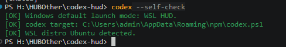
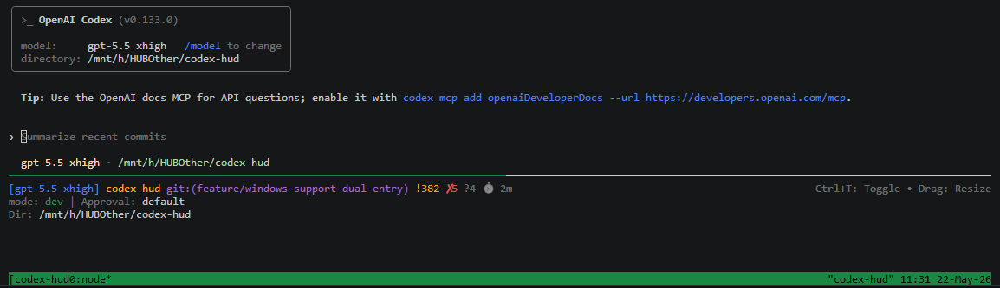

## Modification History

| Date       | Summary of Changes |
|------------|--------------------|
| 2026-05-22 | Windows ユーザー向けに current branch のダウンロード、self-check、WSL 起動手順とスクリーンショットを追加。 |

<p align="center">
  <a href="./README.md"></a>
  <a href="./README.zh.md"></a>
  <a href="./README.ja.md"></a>
  <a href="./README.ko.md"></a>
</p>

# Codex HUD

[OpenAI Codex CLI](https://github.com/openai/codex) 用のリアルタイムステータスバー HUD。軽量・設定不要・tmux 内で動作。

> Claude Code の [claude-hud](https://github.com/jarrodwatts/claude-hud) にインスパイアされています。


## なぜ Codex HUD が必要？

**Q: Codex CLI だけで十分では？**

計器なしのフライトと同じです。Codex HUD はターミナル下部に常駐ダッシュボードを表示します：

- **ブランチ・モデル・権限** —— 一目で把握、推測不要
- **Token 使用量（cache 含む）** —— コンテキストの消費量を正確に把握
- **Context ウィンドウ充填バー** —— 上限に近づいたら即座にわかる
- **MCP サーバー状況 & ツール呼び出し** —— Codex が実際に何をしているか監視
- **Reasoning effort レベル** —— 現在の思考深度を表示

**Q: 複数の Codex セッションを同時に監視できますか？**

はい。`Ctrl+T` で**マルチセッション概要モード**に切り替えると、すべてのアクティブセッションの context 使用状況を一画面で確認できます。


**Q: tmux を手動で設定する必要がありますか？**

不要です。Codex HUD は tmux を自動的に起動します。`codex` と入力するだけで HUD が表示されます。tmux 未インストールの場合もインストーラーが対応します。

## クイックスタート

```bash
git clone https://github.com/fwyc0573/codex-hud.git
cd codex-hud
./bin/codex-hud-install

# シェルをリフレッシュして、以下を入力：
codex
```

### Windows current branch（WSL デフォルト）

この branch では、Windows のサポート対象 HUD runtime は WSL です。PowerShell と cmd はランチャー shell として使い、HUD 本体は Ubuntu WSL の Bash + tmux で動作します。

1. ダウンロードして current branch に切り替えます：

```powershell
git clone https://github.com/fwyc0573/codex-hud.git
cd codex-hud
git switch feature/windows-support-dual-entry
.\bin\codex-hud-install.ps1
```

2. 新しい PowerShell または cmd ウィンドウを開き、WSL runtime を確認します：

```powershell
codex --self-check
```



3. Codex HUD を起動します：

```powershell
codex
```



Notes:

- `codex` は Windows ではデフォルトで WSL HUD を起動します。
- `codex --wsl ...` は同じ WSL HUD パスを明示的に選択し、Codex CLI に渡す前に wrapper 引数を取り除きます。
- native PowerShell HUD は現在、ユーザー向け起動モードとしては未サポートです。legacy native-mode request は fail fast し、WSL HUD の使用を案内します。
- `codex-hud-wsl` は Ubuntu WSL で完全な HUD を起動する明示コマンドです。
- `cmd.exe` ユーザーには、同じ PowerShell entrypoint を呼び出す管理済み `.cmd` shim が提供されます。

### 管理コマンド

初回インストール後、以下のコマンドがシェルに追加されます：

| コマンド | 説明 |
|----------|------|
| `codex-hud-sync` | 現在のチェックアウトを再ビルドしエイリアスを更新 |
| `codex-hud-upgrade` | 最新の変更をプルして再ビルド |
| `codex-hud-uninstall` | エイリアスを削除し HUD セッションを停止 |

## HUD に何が表示される？

```
[gpt-5.4 xhigh] █████░░░░ 45% │ my-project git:(main ●) │ 12m
mode: dev | 3 extensions | 2 AGENTS.md | Approval: on-req | Sandbox: ws-write
Tokens: 50.2K (in: 35.0K, cache: 5.0K, out: 15.2K) | Ctx: ████░░░░ 45% (50.2K/128K) ↻2
Dir: ~/my-project | Session: abc12345 | CLI: 0.4.2
◐ Edit: file.ts | ✓ Read ×3
```

| 行 | 内容 |
|----|------|
| **ヘッダー** | モデル + effort、context バー、プロジェクト名、git ブランチ、セッションタイマー |
| **環境** | 設定数、作業モード、MCP サーバー、命令ファイル、承認/サンドボックス |
| **Tokens** | 合計 token（入力/cache/出力の内訳）、context 充填率、compact 回数 |
| **Session** | 作業ディレクトリ、Session ID、CLI バージョン |
| **アクティビティ** | 実行中のツール呼び出し、最近のツール履歴 |

## 使い方

```bash
codex                        # HUD 付きで起動
codex --model gpt-5          # Codex CLI 引数を渡す
codex "help me debug this"   # プロンプト付き
codex-resume                 # 前回のセッションを再開
```

<details>
<summary>その他のコマンド</summary>

```bash
codex-hud --kill             # 現在のディレクトリのセッションを終了
codex-hud --list             # すべての HUD セッションを一覧表示
codex-hud --attach           # 既存セッションにアタッチ
codex-hud --new-session      # 新規セッションを強制作成
codex-hud --self-check       # 環境診断を実行
```

</details>

## 設定

### 環境変数

| 変数 | デフォルト | 説明 |
|------|------------|------|
| `CODEX_HUD_POSITION` | `bottom` | HUD ペインの位置（`top` / `bottom`） |
| `CODEX_HUD_HEIGHT` | ターミナルの 1/6 | HUD の高さ（行数） |
| `CODEX_HUD_MOUSE` | `1` | マウス/トラックパッドスクロールを有効化 |

<details>
<summary>すべての環境変数</summary>

| 変数 | デフォルト | 説明 |
|------|------------|------|
| `CODEX_HUD_HEIGHT_AUTO` | `0` | 幅に基づいて高さを自動調整 |
| `CODEX_HUD_HEIGHT_MIN` | `CODEX_HUD_HEIGHT` | 自動モードの最小高さ |
| `CODEX_HUD_HEIGHT_MAX` | `12` | 自動モードの最大高さ |
| `CODEX_HUD_AUTO_ATTACH` | `0` | 同ディレクトリの最新セッションに自動アタッチ |
| `CODEX_HUD_ALTERNATE_SCREEN` | `0` | codex ペインの tmux alternate-screen |
| `CODEX_HUD_CLEAR_SCROLLBACK` | `0` | 初回レンダリング時にスクロールバックをクリア |
| `CODEX_HUD_CWD` | （未設定） | 作業ディレクトリを上書き |
| `CODEX_HOME` | `~/.codex` | Codex ホームディレクトリ |
| `CODEX_SESSIONS_PATH` | （未設定） | sessions ディレクトリを上書き |

</details>

### config.toml

HUD は `CODEX_HOME/config.toml` から設定を読み取ります：

```toml
model = "gpt-5.2-codex"
approval_policy = "on-request"
sandbox_mode = "workspace-write"

[mcp_servers.my-server]
command = ["node", "server.js"]
enabled = true
```

## 対応システム

| プラットフォーム | 状態 |
|------------------|------|
| Linux | 対応済み |
| macOS (Apple Silicon) | 対応済み |
| macOS (Intel) | テスト待ち |
| Windows PowerShell | ランチャー shell として対応、native PowerShell HUD は未サポート |
| Windows cmd | 管理済み `.cmd` shim で対応 |
| Windows WSL Ubuntu | Windows のデフォルト HUD パスとして対応 |

## 開発

```bash
npm install && npm run build   # ビルド
npm run dev                    # ウォッチモード
node dist/index.js             # HUD を直接実行
```

## 変更履歴

| 日付 | 変更内容 |
|------|----------|
| 2026-05-22 | Windows current branch の WSL download/self-check/run 手順とスクリーンショットを追加 |
| 2026-04-09 | クイックインストール/同期/アップグレード/アンインストールコマンドを追加 |
| 2026-04-09 | HUD セッションを tmux ペインにバインド、reasoning effort を表示 |
| 2026-02-09 | リサイズ後のメインペインフォーカス修正、マウススクロールのデフォルト改善 |
| 2026-02-09 | セッションアタッチのデフォルトとスクロールバック設定を更新 |

## ライセンス

MIT

## クレジット

Jarrod Watts の [claude-hud](https://github.com/jarrodwatts/claude-hud) にインスパイアされています。[OpenAI Codex CLI](https://github.com/openai/codex) 用に構築。
