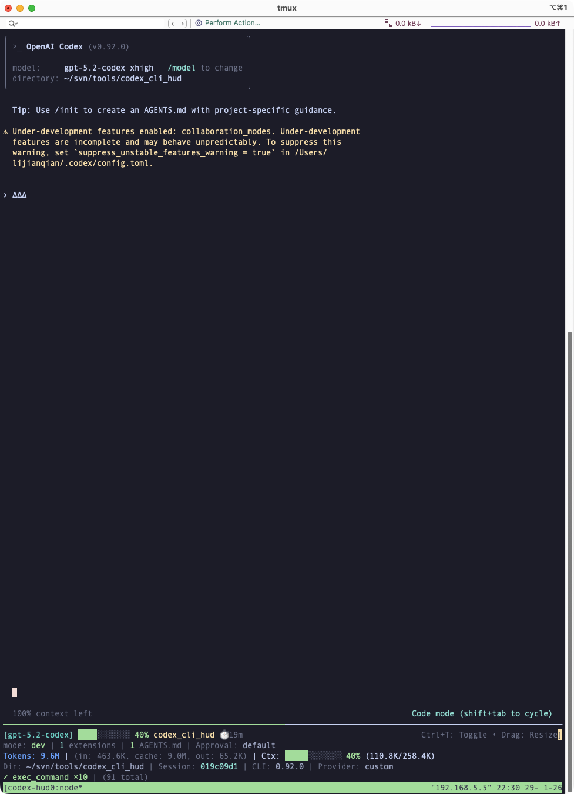

<p align="center">
  <a href="./README.md"></a>
  <a href="./README.zh.md"></a>
</p>

# Codex HUD



Real-time statusline HUD for OpenAI Codex CLI.

> **Note**: This is a wrapper tool that runs alongside Codex CLI, inspired by [claude-hud](https://github.com/jarrodwatts/claude-hud) for Claude Code.

## Quick Start (One Command Install)

```bash
# Clone and install
git clone https://github.com/fwyc0573/codex-hud.git
cd codex-hud
./install.sh

# Close and reopen your terminal or use `source ~/.bashrc` or `source ~/.zshrc` to 
# refresh your shell environment.
# Now just type 'codex' - HUD appears automatically!
```

That's it! After installation, typing `codex` will automatically launch with the HUD display.

## Features

### Phase 1 (Basic)
- **Model Display**: Shows current model from `config.toml`
- **Git Status**: Branch, dirty indicator, ahead/behind, and change counts
- **Project Info**: Project name and working directory
- **Session Timer**: Time since session started
- **Config/Mode Signals**: `.codex` config count, work mode, and extensions (MCP servers)
- **Instruction Signals**: Counts for AGENTS.md, INSTRUCTIONS.md, and `.codex/rules`
- **Approval Policy + Sandbox**: Displays approval policy and sandbox mode when configured

### Phase 2 (Advanced) ✨ NEW
- **Token + Context Usage**: Real-time token and context window usage
  - Reads `token_count` and `turn_started` events from rollout files
  - Uses `last_token_usage` with baseline token reservation
  - Shows `/compact` count from `context_compacted` events
- **Tool Activity Tracking**: Monitors tool invocations
  - Shows recent tool calls count
  - Displays total tool calls in session
  - Parses `function_call` entries from rollout logs
- **File Watching**: Event-driven updates using chokidar
  - Watches config.toml for changes
  - Watches active session rollout files
- **Session Auto-Detection**: Automatically finds active Codex sessions
  - Filters by session CWD and searches recent sessions (default: 30 days)
  - Prioritizes recently modified sessions

### Phase 3 (Seamless Integration) ✨ NEW
- **Automatic tmux Installation**: Installs tmux if not present
- **Shell Alias Integration**: `codex` and `codex-resume` launch with HUD
- **Per-Launch Sessions**: Each run creates a new tmux session and auto-cleans on exit
- **Configurable HUD Position**: Top or bottom (environment variable)
- **One-Command Install/Uninstall**: Simple setup and removal
- **HUD Mode Toggle**: Switch between single-session details and multi-session overview

## Requirements

- **Node.js** 18+
- **OpenAI Codex CLI** installed and in PATH
- **tmux** (auto-installed if missing)
- **Codex home** available at `CODEX_HOME`, `~/.codex`, or `~/.codex_home` (with a `sessions/` directory or `CODEX_SESSIONS_PATH`)

## Installation

### Recommended: Automatic Installation

```bash
# Run the installer
./install.sh
```

The installer will:
1. Install Node.js dependencies
2. Build the TypeScript project
3. Add shell aliases (`codex`, `codex-resume`) to `~/.bashrc` and `~/.zshrc` (with backups)
4. Prompt to install tmux if not present

After installation, refresh your shell environment so the aliases take effect:

```bash
# Bash
source ~/.bashrc

# Zsh
source ~/.zshrc
```

Alternatively, close and reopen your terminal.

### Manual Installation

```bash
# Clone or download this repository
cd codex-hud

# Install dependencies
npm install

# Build the project
npm run build

# Make the wrapper executable
chmod +x bin/codex-hud

# Add alias to your shell config (~/.bashrc or ~/.zshrc)
echo "alias codex='/path/to/codex-hud/bin/codex-hud'" >> ~/.bashrc
echo "alias codex-resume='/path/to/codex-hud/bin/codex-hud resume'" >> ~/.bashrc
source ~/.bashrc
```

## Uninstallation

```bash
./uninstall.sh
```

This will:
- Remove the codex-hud aliases from common shell rc files
- Kill any running codex-hud sessions and HUD panes
- Restore backed-up aliases if available

After uninstalling, refresh your shell environment so the changes take effect:

```bash
# Bash
source ~/.bashrc

# Zsh
source ~/.zshrc
```

Alternatively, close and reopen your terminal.

## System Support

- Linux
- macOS (Apple Silicon)

## Pending Validation

- Windows (testing pending)
- macOS (Intel Silicon) (testing pending)


## Usage

After installation, just use `codex` as you normally would:

```bash
# Basic usage - HUD appears automatically
codex

# With arguments (passed to codex)
codex --model gpt-5

# With initial prompt
codex "help me debug this"

# Resume (passes through to codex CLI)
codex-resume
```

### Additional Commands

```bash
# Kill existing session for current directory
codex-hud --kill

# List all codex-hud sessions
codex-hud --list

# Show help
codex-hud --help

# Run environment diagnostics
codex-hud --self-check
```

### Scrolling in Codex CLI Pane

codex-hud enables tmux mouse mode for each session to make trackpad scrolling smoother and more controllable in the Codex CLI pane.

### Environment Variables

| Variable | Description | Default |
|----------|-------------|---------|
| `CODEX_HUD_POSITION` | HUD pane position: `bottom`, `top` | `bottom` |
| `CODEX_HUD_HEIGHT` | HUD pane height in lines | 1/6 of terminal height (min 3) |
| `CODEX_HUD_NO_ATTACH` | If set, always create new session | (unset) |
| `CODEX_HUD_CWD` | Override working directory used for HUD context/session matching | (unset; wrapper sets) |

### Path Overrides

| Variable | Description | Default |
|----------|-------------|---------|
| `CODEX_HOME` | Codex home directory (config + sessions) | `~/.codex` or `~/.codex_home` |
| `CODEX_SESSIONS_PATH` | Override sessions directory | (unset) |

Example:
```bash
# Put HUD on top
CODEX_HUD_POSITION=top codex

# Taller HUD
CODEX_HUD_HEIGHT=5 codex
```

Note: HUD height is clamped to the available terminal size.

## Display Format

The wrapper creates a tmux session with:
- **Main pane**: Codex CLI
- **HUD pane**: Status lines (expanded layout shows multiple lines; compact layout shows one line)

```
[gpt-5.2-codex] █████░░░░ 45% │ my-project git:(main ●) │ ⏱️ 12m
1 configs | mode: dev | 3 extensions | 2 AGENTS.md | Approval: on-req | Sandbox: ws-write
Tokens: 50.2K (in: 35.0K, cache: 5.0K, out: 15.2K) | Ctx: ████░░░░ 45% (50.2K/128K) ↻2
Dir: ~/my-project | Session: abc12345 | CLI: 0.4.2 | Provider: openai
◐ Edit: file.ts | ✓ Read ×3
```

### Line 1: Header
- `[model-name]` - Current model
- `█████░░░░ 45%` - Context usage bar (from session token data)
- `project-name` - Current directory name
- `git:(branch ●)` - Git branch + dirty indicator (if in repo)
- `⏱️ duration` - Session duration

### Line 2: Environment
- `N configs` - `.codex` config file count
- `mode: dev/prod` - Work mode from environment
- `N extensions` - Enabled MCP servers
- `N AGENTS.md` / `N INSTRUCTIONS.md` / `N rules` - Instruction signals
- `Approval: policy` - Approval policy
- `Sandbox: mode` - Sandbox mode (if configured)

### Line 3: Tokens + Context
- `Tokens: N` - Total tokens (with input/cache/output breakdown when available)
- `Ctx: ███░░ 45% (used/total)` - Context usage bar and counts
- `↻N` - Compact count when `/compact` events occur

### Line 4: Session Details
- `Dir: ~/path` - Working directory (truncated)
- `Session: abc12345` - Session ID (short)
- `CLI: x.y.z` / `Provider: openai` - Optional session metadata

### Line 5+: Activity
- `◐ Edit: file.ts` - Running tool call
- `✓ Read ×3` - Recent tool calls grouped with counts
- Plan progress lines when available

When the HUD height is smaller than the number of available lines, extra lines are trimmed with a `…N more lines hidden` indicator.

## HUD Modes

Codex HUD supports two display modes:

1. **Single Session Mode** (default)
  - Shows detailed info for the current Codex session.
2. **Multi Session Overview Mode**
  - Shows only active sessions (tool calls or generation activity).
  - Each line shows **Context usage** + **Session ID**.

### Toggle Shortcut

- **Prefix + H** (tmux) toggles between modes.
- When focused on the HUD pane, you can also press **Ctrl+T**.

## Configuration

The HUD reads configuration from `CODEX_HOME/config.toml` (defaults to `~/.codex/config.toml`, with fallback to `~/.codex_home/config.toml`).

### Supported Fields

```toml
# Model configuration
model = "gpt-5.2-codex"
model_provider = "openai"

# Approval policy
approval_policy = "on-request"

# Sandbox mode
sandbox_mode = "workspace-write"

# MCP servers
[mcp_servers]
[mcp_servers.my-server]
command = ["node", "server.js"]
enabled = true
```

## Data Sources

### Token Usage (Phase 2)
Token data is extracted from Codex session rollout files:
- Location: `CODEX_SESSIONS_PATH` or `${CODEX_HOME:-~/.codex}/sessions/YYYY/MM/DD/rollout-*.jsonl`
- Format: JSONL with `event_msg` entries containing `token_count`, `turn_started`, and `context_compacted`
- Fields: `total_token_usage`, `last_token_usage`, `model_context_window`, `cached_input_tokens`

### Tool Activity (Phase 2)
Tool invocations are tracked from rollout files:
- Type: `response_item` with `function_call` and `function_call_output`
- Tracked: Tool name, duration, success/failure status
- Display: Recent calls count and total session calls

## Architecture

```
codex-hud/
├── bin/
│   └── codex-hud              # Bash wrapper (creates tmux session)
├── src/
│   ├── index.ts               # Main entry point
│   ├── test-render.ts         # Render test harness
│   ├── types.ts               # Type definitions
│   ├── utils/
│   │   └── codex-path.ts      # Resolve CODEX_HOME + sessions path
│   ├── collectors/
│   │   ├── codex-config.ts    # Parse config.toml
│   │   ├── file-watcher.ts    # chokidar-based watchers
│   │   ├── git.ts             # Git status collection
│   │   ├── project.ts         # Project info collection
│   │   ├── rollout.ts         # Parse session rollout files
│   │   └── session-finder.ts  # Find active sessions
│   └── render/
│       ├── colors.ts          # ANSI color utilities
│       ├── header.ts          # Status line rendering
│       ├── index.ts           # Main renderer
│       └── lines/             # Line renderers
│           ├── activity-line.ts
│           ├── environment-line.ts
│           ├── identity-line.ts
│           ├── project-line.ts
│           ├── session-line.ts
│           └── usage-line.ts
├── dist/                      # Compiled JavaScript
├── package.json
└── tsconfig.json
```

## Development

```bash
# Install dependencies
npm install

# Build
npm run build

# Watch mode (rebuild on changes)
npm run dev

# Run HUD directly (for testing)
node dist/index.js
```

## Known Limitations

1. **Token usage accuracy**: Depends on Codex session rollout format
2. **Requires tmux**: The split-pane display needs tmux
3. **Wrapper launch required**: Use `codex-hud` (or the `codex`/`codex-resume` aliases) to see the HUD
4. **Session detection delay**: Up to 5 seconds to detect new sessions

## Changelog

### v0.2.0 (Phase 2)
- Added token usage display with progress bar
- Added tool activity tracking
- Added session auto-detection
- Added file watching with chokidar
- Added rollout file parsing

### v0.1.0 (Phase 1)
- Initial release
- Basic model, git, project info display
- MCP servers and approval policy display
- tmux wrapper script

## License

MIT

## Credits

Inspired by [claude-hud](https://github.com/jarrodwatts/claude-hud) by Jarrod Watts.

Built for use with [OpenAI Codex CLI](https://github.com/openai/codex).
