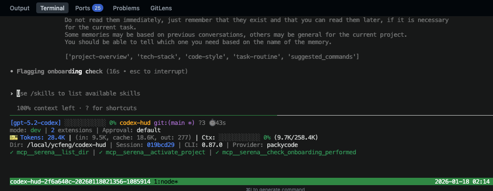
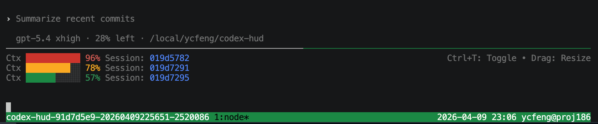

<p align="center">
  <a href="./README.md"></a>
  <a href="./README.zh.md"></a>
  <a href="./README.ja.md"></a>
  <a href="./README.ko.md"></a>
</p>

# Codex HUD

Real-time statusline HUD for [OpenAI Codex CLI](https://github.com/openai/codex). Lightweight, zero-config, works inside tmux.

> Inspired by [claude-hud](https://github.com/jarrodwatts/claude-hud) for Claude Code.



## Why Codex HUD?

**Q: Codex CLI already works. Why do I need a HUD?**

Because you're flying blind without one. Codex HUD gives you a persistent dashboard at the bottom of your terminal:

- **Branch, model, permissions** — at a glance, no guessing
- **Token usage (including cache)** — know exactly how much context you've burned
- **Context window fill bar** — see when you're about to hit the wall
- **MCP server status & tool calls** — watch what Codex is actually doing
- **Reasoning effort level** — see the current thinking depth

**Q: I run multiple Codex sessions. Can I monitor them all?**

Yes. Toggle to **multi-session overview** (`Ctrl+T`) and see every active session with its context usage — all in one place.



**Q: Do I need to set up tmux manually?**

No. Codex HUD auto-activates tmux for you. Just type `codex` and the HUD appears. If tmux isn't installed, the installer handles that too.

## Quick Start

```bash
git clone https://github.com/fwyc0573/codex-hud.git
cd codex-hud
./bin/codex-hud-install

# Refresh your shell, then just type:
codex
```

### Management Commands

After the first install, these are available in your shell:

| Command | Description |
|---------|-------------|
| `codex-hud-sync` | Rebuild and refresh aliases for the current checkout |
| `codex-hud-upgrade` | Pull latest changes, then rebuild |
| `codex-hud-uninstall` | Remove aliases and stop HUD sessions |

## What's on the HUD?

```
[gpt-5.4 xhigh] █████░░░░ 45% │ my-project git:(main ●) │ 12m
mode: dev | 3 extensions | 2 AGENTS.md | Approval: on-req | Sandbox: ws-write
Tokens: 50.2K (in: 35.0K, cache: 5.0K, out: 15.2K) | Ctx: ████░░░░ 45% (50.2K/128K) ↻2
Dir: ~/my-project | Session: abc12345 | CLI: 0.4.2
◐ Edit: file.ts | ✓ Read ×3
```

| Line | Shows |
|------|-------|
| **Header** | Model + effort, context bar, project, git branch, session timer |
| **Environment** | Config count, work mode, MCP servers, instruction files, approval/sandbox |
| **Tokens** | Total tokens with input/cache/output breakdown, context fill, compact count |
| **Session** | Working directory, session ID, CLI version |
| **Activity** | Running tool call, recent tool history |

## Usage

```bash
codex                        # Launch with HUD
codex --model gpt-5          # Pass any Codex CLI args
codex "help me debug this"   # With prompt
codex-resume                 # Resume last session
```

<details>
<summary>More commands</summary>

```bash
codex-hud --kill             # Kill session for current directory
codex-hud --list             # List all HUD sessions
codex-hud --attach           # Attach to existing session
codex-hud --new-session      # Force a new session
codex-hud --self-check       # Run diagnostics
```
</details>

## Configuration

### Environment Variables

| Variable | Default | Description |
|----------|---------|-------------|
| `CODEX_HUD_POSITION` | `bottom` | HUD pane position (`top` / `bottom`) |
| `CODEX_HUD_HEIGHT` | 1/6 terminal | HUD height in lines |
| `CODEX_HUD_MOUSE` | `1` | Enable mouse/trackpad scrolling |

<details>
<summary>All environment variables</summary>

| Variable | Default | Description |
|----------|---------|-------------|
| `CODEX_HUD_HEIGHT_AUTO` | `0` | Auto-adjust height based on width |
| `CODEX_HUD_HEIGHT_MIN` | `CODEX_HUD_HEIGHT` | Min height in auto mode |
| `CODEX_HUD_HEIGHT_MAX` | `12` | Max height in auto mode |
| `CODEX_HUD_AUTO_ATTACH` | `0` | Auto-attach to latest session in same dir |
| `CODEX_HUD_ALTERNATE_SCREEN` | `0` | tmux alternate-screen for codex pane |
| `CODEX_HUD_CLEAR_SCROLLBACK` | `0` | Clear scrollback on first render |
| `CODEX_HUD_CWD` | (unset) | Override working directory |
| `CODEX_HOME` | `~/.codex` | Codex home directory |
| `CODEX_SESSIONS_PATH` | (unset) | Override sessions directory |

</details>

### config.toml

The HUD reads from `CODEX_HOME/config.toml`:

```toml
model = "gpt-5.2-codex"
approval_policy = "on-request"
sandbox_mode = "workspace-write"

[mcp_servers.my-server]
command = ["node", "server.js"]
enabled = true
```

## System Support

| Platform | Status |
|----------|--------|
| Linux | Supported |
| macOS (Apple Silicon) | Supported |
| macOS (Intel) | Testing pending |
| Windows | Testing pending |

## Development

```bash
npm install && npm run build   # Build
npm run dev                    # Watch mode
node dist/index.js             # Run HUD directly
```

## Changelog

| Date | Change |
|------|--------|
| 2026-04-09 | Add quick install/sync/upgrade/uninstall commands |
| 2026-04-09 | Bind HUD session to current tmux pane; display reasoning effort |
| 2026-02-09 | Keep Codex pane focused after resize; refine mouse-scroll defaults |
| 2026-02-09 | Update session attach defaults and scrollback config |

## License

MIT

## Credits

Inspired by [claude-hud](https://github.com/jarrodwatts/claude-hud) by Jarrod Watts. Built for [OpenAI Codex CLI](https://github.com/openai/codex).
