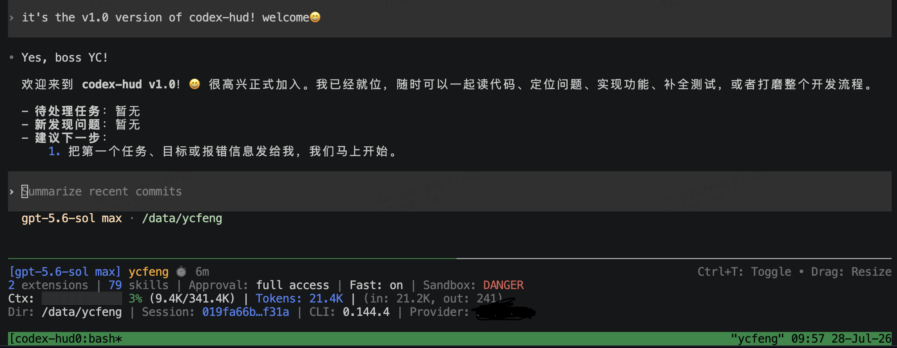
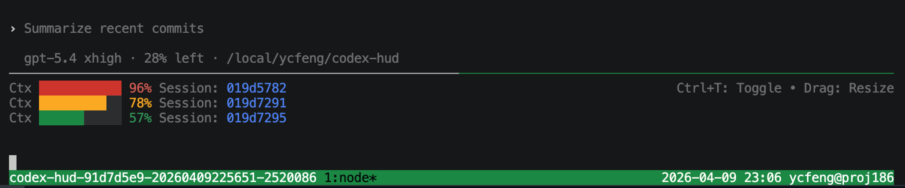

<p align="center">
  <a href="./README.md"></a>
  <a href="./README.zh.md"></a>
  <a href="./README.ja.md"></a>
  <a href="./README.ko.md"></a>
</p>

# Codex HUD

Real-time statusline HUD for [OpenAI Codex CLI](https://github.com/openai/codex). Lightweight, zero-config, works inside tmux.

> Inspired by [claude-hud](https://github.com/jarrodwatts/claude-hud) for Claude Code.




## News

- **[2026-08-15]** Added automatic detection of OpenAI upstream "capacity exceeded" blocks, with automatic "continue" handling. See `cx-continue/README.md` for usage.
- **[2026-07-20]** Released the first stable version, v1.0, with full support for macOS and Linux.


## Why Codex HUD?

**Q: Codex CLI already works. Why do I need a HUD?**

Because you're flying blind without one. Codex HUD gives you a persistent dashboard at the bottom of your terminal:
- **tmux** — natively run Codex CLI in an optimized tmux with zero setup (scroll up and down to review the conversation history)
- **Auto-continue** — automatically detect OpenAI "capacity exceeded" blocks and resume the task by sending "continue"
- **Branch, model, permission, mode** — at a glance, no guessing
- **MCP server status & tool calls, skills & agent actions** — watch what Codex is actually doing
- **Context window fill bar** — graphically see when you're about to hit the wall


**Q: I run multiple Codex sessions. Can I monitor them all?**

Yes. Toggle to **multi-session overview** (`Ctrl+T`) and see every active session with its context usage — all in one place.



**Q: Do I need to set up tmux manually?**

No. Codex HUD auto-activates tmux for you. Just type `codex` and the HUD appears. If tmux isn't installed, the installer handles that too.

If you launch `codex`, `cx`, or `codex-hud` from an existing tmux pane, the
wrapper opens a nested client on the same tmux socket and keeps the outer
session alive. Closing the HUD returns you to the original pane.

## Quick Start

### One prompt to install (by agents)
```bash
Install codex-hud (https://github.com/fwyc0573/codex-hud) for the Codex CLI by following the instructions in its README.md. To enable automatic detection of Codex "capacity exceeded" and auto-send "continue", go to cx-continue/ and run ./bin/cx-continue-ctl start.

```

### macOS/Linux (`main`)

```bash
git clone https://github.com/fwyc0573/codex-hud.git
cd codex-hud
git switch main
./bin/codex-hud-install

# Refresh your shell, then type (codex remains the native launcher for Codex CLI):
cx

# To enable automatic detection of Codex "capacity exceeded" and auto-send "continue", run:
cd cx-continue
./bin/cx-continue-ctl start     # start in the background
./bin/cx-continue-ctl status    # is it running, and what is each pane doing
./bin/cx-continue-ctl stop      # stop it
./bin/cx-continue-ctl restart   # stop then start
./bin/cx-continue-ctl logs      # follow the log
```

### Windows (WSL) (`feature/windows-support-dual-entry`)

```powershell
# warning: windows version support is in early testing and may be unstable.

git clone https://github.com/fwyc0573/codex-hud.git
cd codex-hud
git switch feature/windows-support-dual-entry
.\bin\codex-hud-install.ps1

# Open a new PowerShell or cmd window, then check:
codex --self-check

# Run with the WSL HUD:
codex
```

### Management Commands

After the first install, these are available in your shell:

| Command | Description |
|---------|-------------|
| `cx` | Start Codex with the HUD (same wrapper as `codex`) |
| `codex-hud-sync` | Rebuild and refresh aliases for the current checkout |
| `codex-hud-upgrade` | Transactionally fetch, verify, and activate the latest build |
| `codex-hud-uninstall` | Remove aliases and stop HUD sessions |

## What's on the HUD?

```
[gpt-5.4 xhigh] █████░░░░ 45% │ my-project git:(main ●) │ 12m
3 extensions | 3 skills | 2 hooks | 2 AGENTS.md | Approval: ask for approval | Fast: on | Sandbox: ws-write
Ctx: ████░░░░ 45% (50.2K/128K) | Tokens: 50.2K | (in: 35.0K, cache: 5.0K, out: 15.2K) | ↻2
Dir: ~/my-project | Session: abc12345 | CLI: 0.4.2
◐ Edit: file.ts | ✓ Read ×3
◐ codex_cli_explore 2m14s ↳2
```

| Line | Shows |
|------|-------|
| **Header** | Model + effort, context bar, project, git branch, session timer |
| **Environment** | Config count, MCP servers, enabled skills/hooks, instruction files, approval/sandbox, Fast mode |
| **Tokens** | Total tokens with input/cache/output breakdown, context fill, compact count |
| **Session** | Working directory, session ID, CLI version |
| **Activity** | Running tool calls, recent tool history, and active subagents |

Approval is shown as `ask for approval`, `approve for me`, or `full access` from the
latest Codex runtime permission state. If permission changes while Codex is running,
the HUD refreshes the displayed state without restarting the session. HUD-created tmux
sessions use a project-readable name such as
`codex-hud-new-topic-research-a1b2c3d4-20260727220308-2505832`.
`Fast: on` reflects the active priority service tier; `Fast: off` reflects the default
tier. The skills and hooks values count enabled, valid entries from the effective configured
scopes for the current cwd. The counts use a five-second in-process cache, so local
skills/hooks file changes normally appear within about five seconds.
The wrapper starts Codex directly in its tmux pane, so the launch command is not echoed
into the terminal while the HUD is attaching. A default HUD occupies five rows; set
`CODEX_HUD_HEIGHT` when a different fixed height is required.

### Subagent activity

Expanded mode shows one icon-first row per visible direct child, such as `◐ codex_cli_explore 2m14s ↳2`. The name is the leaf of the typed agent path, and `↳N` is the number of visible active descendants at any depth. A completed or aborted turn disappears immediately unless an active descendant keeps its direct-child aggregate visible. Authoritative rollout or metadata failures remain visible as `✗ <name> tracking error` and retry the same typed child path until it recovers.

Compact mode shows `Agents: N`, where `N` counts all visible tracked agent nodes in the root-owned tree rather than only the displayed direct-child rows. Multi-session overview excludes typed subagent sessions because their activity is already represented by the owning root session.

`CODEX_HUD_AGENT_INACTIVITY_TIMEOUT_MS` controls the running-turn inactivity window. It defaults to `900000` ms (15 minutes) and accepts only a positive safe integer in milliseconds; invalid, empty, zero, negative, decimal, or unsafe values fail at startup. The timeout hides stale presentation only. It does not interrupt an agent and cannot prove that an agent is hung or has crashed. `starting` and `tracking error` entries do not time out.

## Usage

```bash
codex                        # Launch with HUD
codex --model gpt-5          # Pass any Codex CLI args
codex "help me debug this"   # With prompt
cx                           # Start the same HUD wrapper with a short command
codex-resume                 # Resume last session
```

<details>
<summary>More commands</summary>

```bash
codex-hud --kill             # Kill session for current directory
codex-hud --list             # List all HUD sessions
codex-hud --attach           # Attach to existing session
codex-hud --new-session      # Force a new session
codex-hud --self-check       # Run diagnostics
```
</details>

### Update reminders

Each new `codex`, `cx`, `codex-resume`, or direct `codex-hud` session checks the
latest formal GitHub Release at most once every 12 hours. If a newer stable
version is found, an interactive terminal shows:

```text
[codex-hud] Update available: v旧 → v新. Update after this session exits? [Y/n]
```

Confirming records the request; final scheduling occurs after the new tmux
session is registered with its checkout-scoped close hook. A normal detach
keeps Codex running and does not trigger the update. On the true final session
closure, the updater fetches an exact fast-forward target and installs
dependencies and builds it in an isolated staging worktree. The active checkout
fast-forwards only after that build succeeds, so dependency or build failure
leaves its HEAD and worktree unchanged. Reusing an existing session does not
prompt. State and logs are kept outside the checkout under
`$XDG_STATE_HOME/codex-hud/` (or `~/.local/state/codex-hud/`); set
`CODEX_HUD_UPDATE_CHECK=0` or `false` to disable checks.
`codex-hud-upgrade` uses the same transactional flow for an immediate manual
upgrade.

## Configuration

### Environment Variables

| Variable | Default | Description |
|----------|---------|-------------|
| `CODEX_HUD_POSITION` | `bottom` | HUD pane position (`top` / `bottom`) |
| `CODEX_HUD_HEIGHT` | 5 lines | HUD height in lines |
| `CODEX_HUD_MOUSE` | `1` | Enable mouse/trackpad scrolling |
| `CODEX_HUD_UPDATE_CHECK` | enabled | Check formal GitHub releases and offer a deferred update (`0`/`false` disables) |

<details>
<summary>All environment variables</summary>

| Variable | Default | Description |
|----------|---------|-------------|
| `CODEX_HUD_HEIGHT_AUTO` | `0` | Auto-adjust height based on width |
| `CODEX_HUD_HEIGHT_MIN` | `CODEX_HUD_HEIGHT` | Min height in auto mode |
| `CODEX_HUD_HEIGHT_MAX` | `12` | Max height in auto mode |
| `CODEX_HUD_AUTO_ATTACH` | `0` | Auto-attach to latest session in same dir |
| `CODEX_HUD_ALTERNATE_SCREEN` | `0` | tmux alternate-screen for codex pane |
| `CODEX_HUD_CLEAR_SCROLLBACK` | `0` | Clear scrollback on first render |
| `CODEX_HUD_BIND_TOGGLE` | `0` | Opt in to the legacy server-wide Prefix+H HUD toggle |
| `CODEX_HUD_UPDATE_CHECK` | enabled | Check once per 12 hours for a newer stable GitHub Release; ask before scheduling an update after session exit |
| `CODEX_HUD_AGENT_INACTIVITY_TIMEOUT_MS` | `900000` | Running-agent presentation timeout; positive safe integer milliseconds only |
| `CODEX_HUD_CWD` | (unset) | Override working directory |
| `CODEX_HOME` | `~/.codex` | Codex home directory |
| `CODEX_SESSIONS_PATH` | (unset) | Override sessions directory |

</details>

### config.toml

The HUD reads from `CODEX_HOME/config.toml`:

```toml
model = "gpt-5.2-codex"
approval_policy = "on-request"
sandbox_mode = "workspace-write"
service_tier = "priority"
hooks = true

[mcp_servers.my-server]
command = ["node", "server.js"]
enabled = true
```

## System Support

| Platform | Status |
|----------|--------|
| Linux | Supported |
| macOS (Apple Silicon) | Supported |
| macOS (Intel) | Testing pending |
| Windows (WSL) | Supported on `feature/windows-support-dual-entry` |

## Development

```bash
npm install && npm run build   # Build
npm run dev                    # Watch mode
node dist/index.js             # Run HUD directly
```

## License

MIT

## Credits

Inspired by [claude-hud](https://github.com/jarrodwatts/claude-hud) by Jarrod Watts. Built for [OpenAI Codex CLI](https://github.com/openai/codex).
